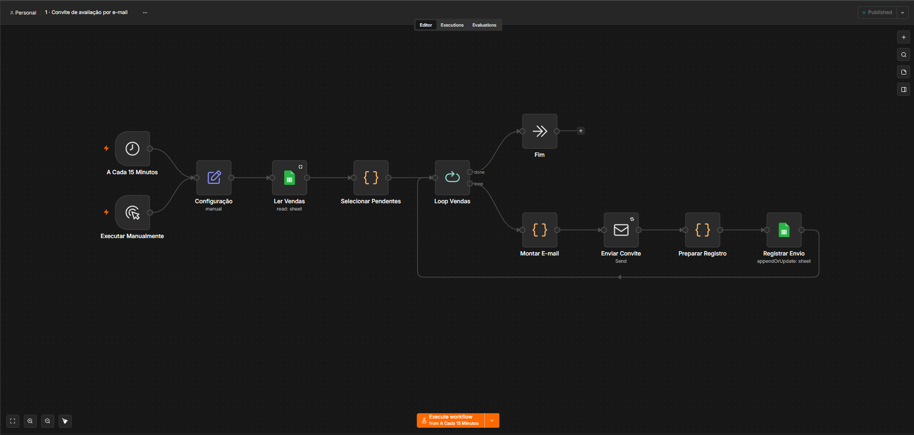
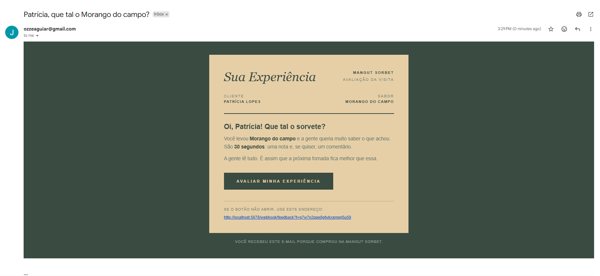
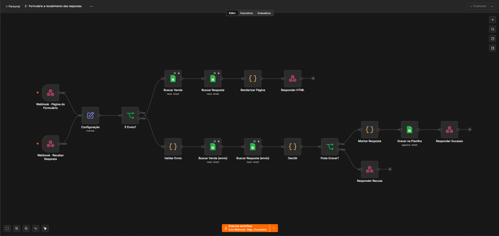
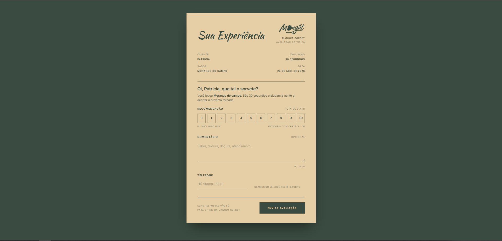
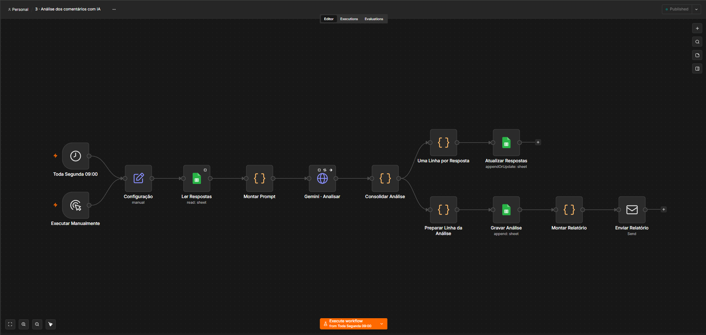
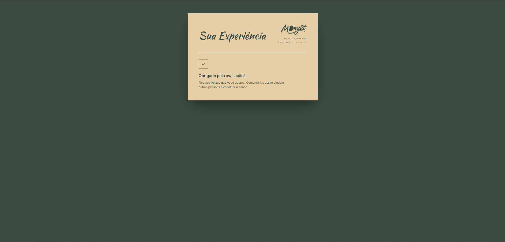

# Feedback pós-compra

Pesquisa de satisfação automatizada, do convite ao relatório.

Uma sorveteria vende um pote. No dia seguinte o cliente recebe um e-mail com um
link só dele, dá uma nota de 0 a 10 e escreve duas linhas se quiser. Segunda de
manhã, o dono abre a caixa de entrada e lê o que mudou na semana — sem abrir
planilha nenhuma.

`n8n` · `Google Sheets` · `Gemini` · `JavaScript` · `Python` · `SMTP`

Três workflows, um formulário e nenhuma ferramenta paga. O setup completo está
em [`GUIA_SETUP.md`](GUIA_SETUP.md).

---

## 1. O convite

A cada 15 minutos o fluxo lê a aba `vendas`, separa quem comprou há mais de 24
horas e ainda não foi convidado, gera um token de 24 caracteres para cada um e
dispara o e-mail. O token volta para a planilha, que é o controle de "já
mandei".



O e-mail é curto de propósito. Um pedido, um botão, uma saída. E-mail de
pesquisa comprido é e-mail não respondido.



A espera de 24 horas não é detalhe: pedir avaliação no minuto seguinte ao
pagamento é pedir avaliação de um produto que o cliente ainda não provou.

---

## 2. O formulário

O link do e-mail cai num webhook GET. O n8n procura o token na planilha e
devolve a página **já com o nome e o sabor dentro do HTML**. Não existe uma
segunda requisição buscando os dados depois.



Isso resolve três coisas de uma vez: some o pisca-pisca de placeholder, cai uma
requisição, e a página passa a sair da mesma origem dos webhooks — o que zera
qualquer configuração de CORS.



O cliente nunca digita o que a sorveteria já sabe. Nome, sabor e telefone vêm
da venda. A pergunta é *"Oi, Camila, que tal o sorvete?"*, não *"informe seu
nome"*.

O texto responde à nota. Quem dá 3 lê *"Poxa, desculpa por isso"* e o comentário
vira obrigatório. Quem dá 10 lê *"Que ótimo saber disso!"*. Uma pesquisa que
responde igual para os dois é um formulário, não uma conversa.

Cada estado tem tela própria: link inválido, já respondido, carregando, erro de
envio, sucesso. A tela de erro avisa que as respostas continuam preenchidas.

A escala 0–10 é um `radiogroup` navegável pelas setas do teclado, com
`aria-label` por opção. Cor nunca carrega significado sozinha — toda faixa de
nota vem com texto junto.

---

## 3. O relatório

Toda segunda às 9h o fluxo lê as respostas ainda não analisadas, calcula as
métricas em JavaScript, manda só os comentários para o Gemini e monta o e-mail.





**A IA não calcula nada.** NPS, média e contagem de promotores e detratores são
JavaScript. O modelo faz só o que modelo de linguagem faz bem: resumir, agrupar
tema e classificar sentimento. Número errado num relatório destrói a confiança
no projeto inteiro, e LLM não é calculadora.

**A saída da IA tem schema.** A chamada usa `responseSchema`, então o node
seguinte recebe JSON validado em vez de um texto para adivinhar com regex.

**A IA pode falhar sem derrubar o pipeline.** Se o Gemini der timeout, estourar
cota ou devolver algo inesperado, o relatório sai mesmo assim — com as métricas
e o motivo real da falha no lugar do resumo.

**Vai o mínimo para a IA.** Só nota, sabor e comentário. Nome, e-mail e telefone
do cliente nunca saem da planilha. Tem teste garantindo isso.

---

## Outras decisões

**A planilha é a fonte da verdade, nunca o navegador.** O que chega no POST é
tratado como dado hostil: nome, e-mail e sabor gravados vêm sempre da linha da
venda. O navegador só opina sobre nota, comentário e telefone.

**Cada recusa tem um código HTTP próprio.** Token inexistente responde 404,
resposta duplicada 409, nota fora da faixa 400 — e o robô que caiu no honeypot
recebe **200**, porque avisar um bot de que ele foi detectado só ajuda o bot.

**O token é gravado, não assinado.** Cada convite gera uma string aleatória que
vira a chave de busca. É revogável apagando a célula e não depende de segredo
nenhum no código.

**Os workflows são gerados, não editados à mão.** `tests/gerar_workflows.py`
monta os 41 nodes a partir de Python legível e embute `site/formulario.html` na
hora da geração — então a página continua sendo um `.html` de verdade, editável
em qualquer editor. As colunas da planilha são declaradas uma vez e alimentam
tanto o schema dos nodes quanto a planilha modelo, que por isso nunca saem de
sincronia.

---

## Editando a página

O `site/formulario.html` está dividido em seis blocos marcados com comentário.
Dois deles são para editar sem saber programar:

- **BLOCO 2 · TEXTOS** — toda frase da página num objeto só, incluindo as que
  mudam conforme a nota
- **BLOCO 3 · TEMA** — cores, fontes e tamanhos em variáveis CSS

Os outros quatro (técnico, layout, estrutura, lógica) não precisam ser tocados
para mudar aparência ou texto.

Depois de editar, rode `make workflow` para reembutir a página no workflow 2.

---

## Rodando

Você precisa de n8n rodando local, uma conta Google e uma chave gratuita do
Gemini. O passo a passo completo está em [`GUIA_SETUP.md`](GUIA_SETUP.md).

```bash
git clone <seu-repo> && cd feedback-pos-compra
make planilha        # gera planilha/modelo_planilha.xlsx
```

1. Suba `planilha/modelo_planilha.xlsx` no Drive e abra como Planilhas Google
2. Importe os três arquivos de `workflows/` no n8n
3. Em cada workflow, abra o node **Configuração** e cole o ID da planilha
4. Conecte as credenciais: Google Sheets, SMTP e a chave do Gemini
5. Rode o workflow 1 na mão — o convite chega no seu e-mail

Para ver a página sem subir nada:

```bash
make demo    # sobe um n8n falso e serve o formulário em localhost:8080
```

Os tokens `demo-1`, `demo-2` e `demo-usada` exercitam todos os estados.

---

## Testes

```
$ make testar

WORKFLOW 1 · Selecionar Pendentes
  ✓ pula quem já recebeu convite
  ✓ pula compra recente (janela de 24h)
  ✓ entende data no formato brasileiro dd/mm/aaaa
WORKFLOW 2 · Renderizar Página
  ✓ nome de produto com </script> é escapado (não quebra a página)
WORKFLOW 2 · Validar Envio e Decidir
  ✓ robô não grava, mas recebe 200 (não revela que foi detectado)
WORKFLOW 3 · Montar Prompt
  ✓ NPS calculado em JavaScript, não pela IA (-10)
  ✓ e-mail do cliente NÃO é enviado para a IA
WORKFLOW 3 · Consolidar Análise
  ✓ métricas saem mesmo com a IA fora do ar
```

São 91 verificações em menos de um segundo, sem planilha, sem SMTP e sem chave
de IA. `tests/test_code_nodes.mjs` executa o JavaScript real dos nodes `Code`
com `$input`, `$json` e `$()` simulados.

`tests/test_estrutura.py` valida o grafo: se toda conexão aponta para um node
que existe, se todo `$('X')` referencia um node que é **ancestral** de quem o
chama, se sobrou node órfão e se todo webhook alcança um Respond to Webhook.
Essa suíte nasceu de um bug real — o node `Configuração` estava ligado só ao
webhook GET, e na rota POST ele nunca executava. O erro aparecia três nodes
depois, disfarçado de "token inválido".

---

## Estrutura

```
site/formulario.html            a página (embutida no workflow 2 na geração)
workflows/                      os três JSONs prontos para importar
planilha/modelo_planilha.xlsx   abas vendas · respostas · analise · painel
scripts/gerar_planilha.py       gera a planilha modelo
tests/gerar_workflows.py        gerador dos workflows (fonte da verdade)
tests/test_code_nodes.mjs       lógica dos nodes Code
tests/test_estrutura.py         validação do grafo
tests/n8n_falso.py              webhooks simulados para desenvolvimento
Makefile                        `make ajuda` lista tudo
```

| Aba | Quem preenche | Para quê |
|---|---|---|
| `vendas` | você (ou a loja) + workflow 1 | fila de convites; `token` e `convite_enviado_em` são o controle de "já mandei" |
| `respostas` | workflow 2 + workflow 3 | uma linha por avaliação, com nota, classificação NPS, comentário e depois sentimento e temas |
| `analise` | workflow 3 | uma linha por execução: NPS do período, resumo da IA, temas e ações |
| `painel` | fórmulas | NPS, nota média e distribuição ao vivo, sem depender de workflow nenhum |

---

## Limitações conhecidas

**Google Sheets não é banco.** Acima de alguns milhares de respostas as leituras
ficam lentas e não há transação — duas respostas simultâneas do mesmo token
poderiam, em tese, gravar duas linhas. Para volume real, o caminho é Postgres.

**O token não expira.** Quem guardar o link consegue abrir a página depois; só
não consegue responder de novo. Um campo `expira_em` na aba `vendas` resolveria.

**Sem alerta imediato de nota baixa.** Hoje o detrator aparece só no relatório
semanal. Um `IF` depois de `Gravar na Planilha` mandando e-mail quando a nota
for ≤ 6 seria o próximo node.

**O n8n precisa estar acessível pelo cliente.** Em `localhost` o link do e-mail
só funciona na sua máquina; para valer de verdade, exponha por túnel ou
hospede.

---

## Próximos passos

- [ ] Alerta na hora quando a nota for ≤ 6, com o telefone do cliente junto
- [ ] Lembrete automático para quem não respondeu em 3 dias
- [ ] Trocar Google Sheets por Postgres e plugar um BI
- [ ] Webhook `POST /nova-venda` para a loja empurrar a venda
- [ ] Comparar temas entre períodos ("espera na fila" subiu 40% este mês)
